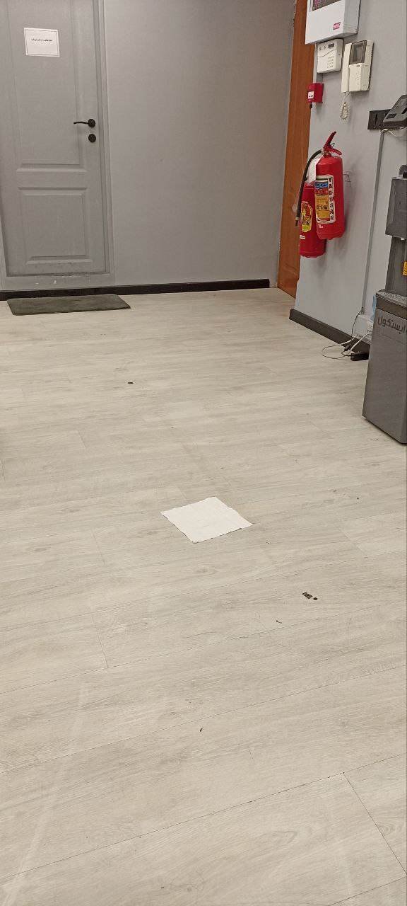

# AR-Carpet
In this repo, I implemented a demo that uses state-of-the-art models to visualize carpets inside images!

**All you need is a tissue on the floor, and the texture image of the carpet you desire.**

Then you can turn this: 

into:

isn't computer vision just **awesome**?!!
